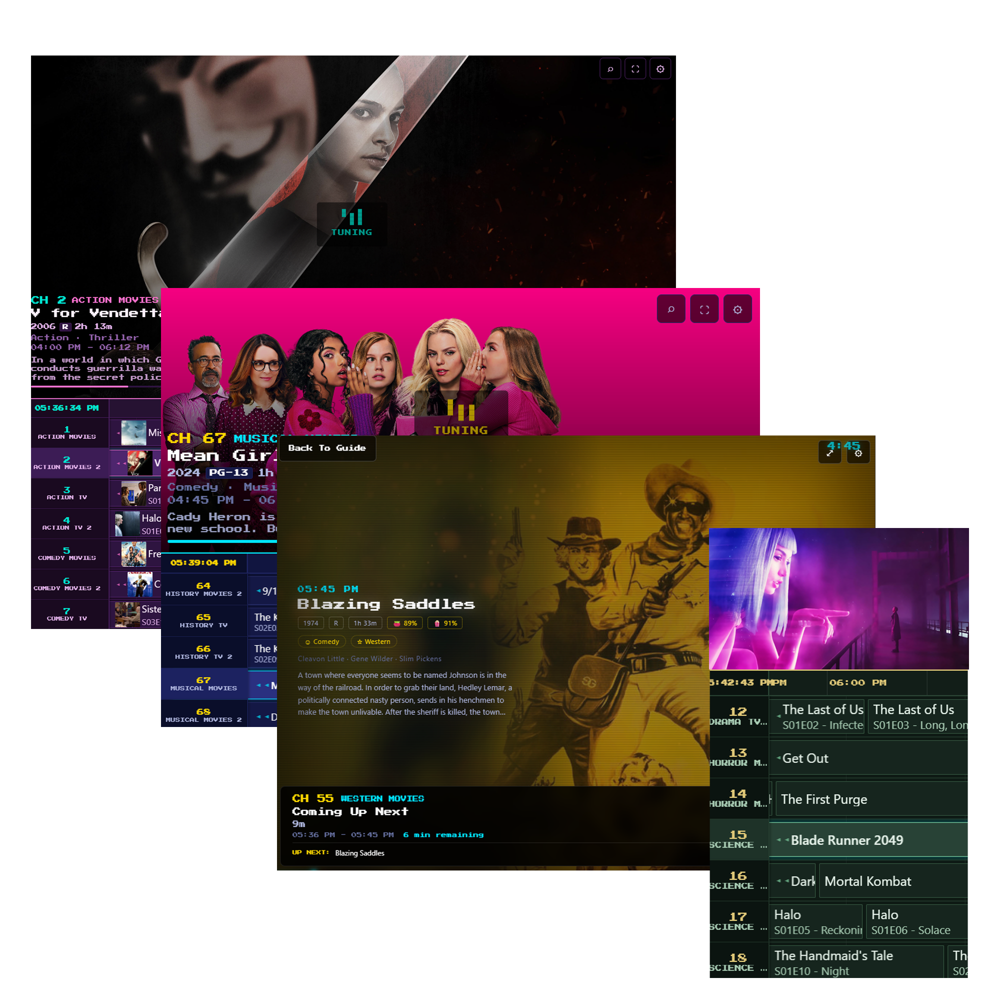
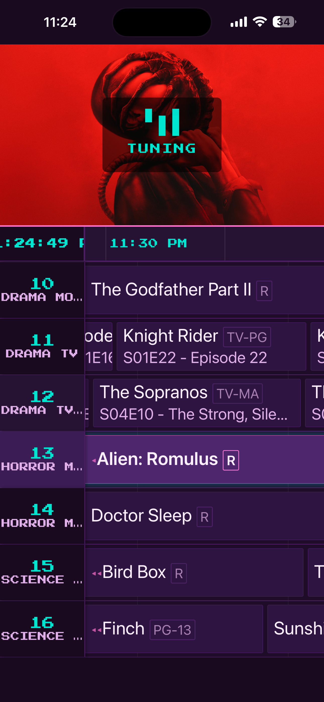
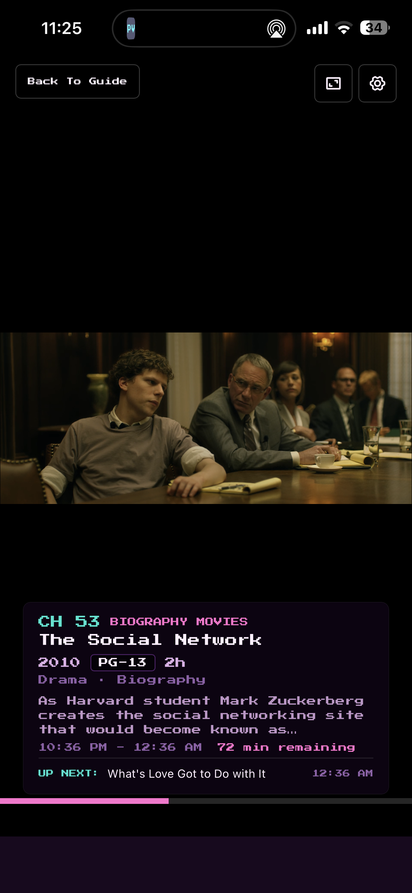
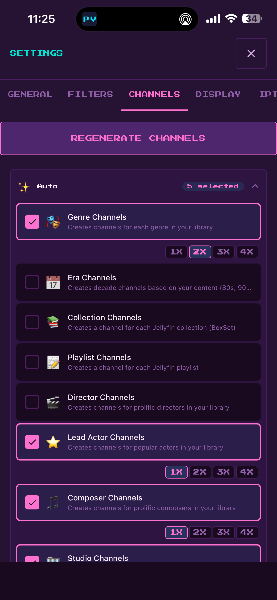

# Prevue



A self-hosted, retro cable TV guide for Jellyfin and Plex. Prevue transforms your personal media library into a classic channel-surfing experience — complete with auto-generated channels, a full electronic program guide, a built-in video player, and IPTV output for external apps. It's a fun way to rediscover your media library.

Open source under CC BY-NC-SA 4.0. Free for personal and non-commercial use.

## Key Features

- **Self-hosted** — Run on your own server, your own network, your own terms. Docker or bare metal.
- **Jellyfin & Plex integration** — Connects to your Jellyfin or Plex media server and syncs your full movie and TV library.
- **AI-powered channel creation** — Generate channels from natural language prompts using an AI agent via OpenRouter (e.g. "90s nostalgia" or "Christopher Nolan marathon").
- **Preset and custom channels** — Auto-generates channels by genre, era, director, actor, collection, and more. Create your own with manual item lists or AI prompts.
- **Content filters** — Filter channels by content type (movies, TV shows, or both), ratings, genres, and unwatched status.
- **Hardware transcoding** — Leverages your media server's transcoding pipeline with selectable quality presets (Auto, 4K, 1080p, 720p, 480p) and HEVC support.
- **Subtitle and audio track support** — Full multi-track subtitle and audio selection, with per-language preferences and persistence.
- **Full-featured guide and player** — Retro Prevue Channel-inspired EPG grid with a built-in HLS video player, overlay controls, nerd stats, and picture-in-picture.
- **IPTV server with EPG** — Exposes an M3U playlist and XMLTV EPG feed so you can watch your channels in Kodi, VLC, Jellyfin, or any IPTV client.
- **Open source** — Inspect, modify, and contribute. Licensed for non-commercial use.

| EPG | Full Screen | Settings |
|:---:|:---:|:---:|
|  |  |  |


## Quick Start (Docker)

```bash
# Clone and configure
cp .env.example .env
# Edit .env with your settings (API key, encryption key, OpenRouter key, etc.)

# Run with Docker Compose
docker compose up -d
```

Open `http://localhost:3080` in your browser.
Go to **Settings > Servers** to connect your Jellyfin or Plex server. Your library will sync automatically and channels will be generated on first run.

### Jellyfin Discovery in Docker

If **Discover Servers** returns no results, this is usually Docker networking (not a Prevue bug).
In bridge mode, container LAN discovery can miss Jellyfin broadcasts/subnets.

- Recommended fallback: manually enter your Jellyfin URL (e.g. `http://<jellyfin-ip>:8096`).
- Optional (Linux): use host networking by adding `network_mode: host` to your compose service.

> **Note:** Server discovery is only available for Jellyfin. Plex servers are discovered automatically via plex.tv after signing in.

## Quick Start (Development)

```bash
npm install
cp .env.example .env
npm run dev
```

- Client: http://localhost:5173 (Vite dev server, proxies API to :3080)
- Server: http://localhost:3080

## Connecting a Media Server

Prevue connects to your media server entirely through the app UI — no environment variables needed for the connection itself.

### Jellyfin

1. Open **Settings > Servers**
2. Select **Jellyfin** as the server type
3. Enter your Jellyfin server URL, username, and password
4. Prevue syncs your full movie and episode library (with genres, directors, actors, ratings, artwork)
5. Channels are auto-generated from your library content
6. Watch progress can optionally be shared back to Jellyfin (configurable in Settings)

Supports local LAN URLs, remote URLs, and manual or discovered server entry.

### Plex

1. Open **Settings > Servers**
2. Select **Plex** as the server type
3. Sign in with your Plex account via PIN-based authentication (opens plex.tv)
4. Select a server from your available Plex servers
5. Prevue syncs your movie and TV library and auto-generates channels

Plex uses OAuth-style PIN authentication — your Plex password is never entered into Prevue.

## Channels

### Auto-Generated Channels

On first sync, Prevue creates channels based on your library metadata:

- **Genre** — Action, Comedy, Drama, Horror, Sci-Fi, etc.
- **Era** — 80s, 90s, 2000s, etc.
- **Director** — Spielberg, Nolan, Fincher, and more
- **Actor** — Hanks, DiCaprio, Streep, and more
- **Collection** — Box sets and collections from your media server
- **Composer** — Williams, Zimmer, Shore, and more

### Preset Channels

Additional curated presets available in Settings:

- **Time & Mood** — Late Night, Saturday Morning, Feel Good
- **Audience** — Kids, Family, Adults Only
- **Smart** — Unwatched, Favorites, Continue Watching
- **Thematic** — Holiday, Cult Classics, Award Winners

### AI Channel Creation

With an OpenRouter API key configured, you can create channels by describing them in plain English:

> "80s action movies", "Studio Ghibli marathon", "movies about space exploration"

Prevue sends a compact summary of your library to an AI model, which selects matching content and builds the channel automatically. Configure your API key in `.env` or in **Settings > Channels**.

Default model: `google/gemini-3-flash-preview` (configurable in Settings).

## Guide and Player

### Electronic Program Guide

- Retro Prevue Channel-inspired scrolling grid
- Configurable time window (1-4 hours) and visible channels (3-15)
- Program preview panel with artwork, title, description, and duration
- Color-coded entries (movies vs. episodes, customizable)
- Per-channel color coding with preset color palette
- Guide dividers — labeled section separators to organize your channel lineup
- Auto-scroll with adjustable speed (slow, normal, fast)
- Classic or modern preview style
- Keyboard navigation (arrow keys, Enter to tune, Escape for settings)
- Touch and swipe support on mobile

### Built-in Player

- HLS adaptive bitrate streaming via hls.js
- Quality selection: Auto, 4K, 1080p, 720p, 480p
- Subtitle and audio track selection overlay
- Fullscreen, picture-in-picture, and video fit (contain/cover) modes
- Info overlay with channel name, program title, time remaining, and next up
- Promo overlay — periodic broadcast-style popups showing what you're watching, what's coming up next, and what's starting soon on other channels (toggleable in Settings). "Starting Soon" promos are clickable — tap to tune directly to that channel.
- Nerd stats panel: resolution, bitrate, codec, FPS, buffer health
- Channel up/down while watching
- Progress reporting back to Jellyfin/Plex
- Auto-advances to next program when current one ends

### Interstitial Screen

- Cinematic "coming soon" screen between programs with countdown, channel ident, lineup carousel, and program spotlight
- Ambient video texture overlay for visual depth
- Background music with audio-reactive animations
- CRT scanline overlay and floating particles

## Hardware Transcoding

Prevue proxies HLS streams through your media server's transcoding pipeline. If your server has hardware transcoding configured (VAAPI, NVENC, QSV, etc.), Prevue benefits automatically.

- Quality presets with configurable bitrate and resolution caps
- HEVC support (when your server is configured for it)
- Smart request deduplication to prevent duplicate transcoding jobs
- Idle session cleanup after 5 minutes of inactivity

## API Resilience

Prevue includes built-in protections against rate limiting and redundant API calls:

- **Request deduplication** — Concurrent identical GET requests share a single in-flight fetch
- **Retry with exponential backoff** — 429 (rate limit) responses are retried up to 3 times with 1s/2s/4s delays, respecting `Retry-After` headers
- **Debounced schedule reloads** — Rapid WebSocket events (channel changes, schedule updates) are collapsed into a single reload with a 2-second debounce window
- **Server-side caching** — Item details (5-min TTL) and playback session info (60s TTL) are cached to reduce media server API calls during rapid navigation

## Subtitle Support

- Displays all available subtitle tracks (embedded and external)
- In-player track selection with language and display name
- Subtitle preference persisted across sessions
- Server-side preferred subtitle index configurable in Settings
- WebVTT delivery via HLS

## IPTV Server

Prevue includes a built-in IPTV server that exposes your channels to external players and apps.

### Endpoints

| Endpoint | Description |
|----------|-------------|
| `/api/iptv/playlist.m3u` | M3U playlist with all channels |
| `/api/iptv/epg.xml` | XMLTV electronic program guide |
| `/api/iptv/channel/:number` | Live HLS stream for a channel |

### Usage

1. Enable IPTV in **Settings > IPTV**
2. Set your base URL if needed (auto-detected on LAN)
3. Add the M3U URL to your IPTV client (Kodi, VLC, Jellyfin Live TV, TiviMate, etc.)
4. The EPG URL is embedded in the playlist and loaded automatically by most clients

The IPTV stream uses a sliding-window live mode — external players see a continuous live stream, just like real cable TV. EPG data covers 24-48 hours of programming.

## Mobile App (PWA)

Prevue can be installed as a Progressive Web App on iOS, Android, and desktop — no app store required.

### iOS (Safari)

1. Open your Prevue instance in Safari
2. Tap the **Share** button (box with arrow)
3. Tap **Add to Home Screen**
4. Name it "Prevue" and tap **Add**

### Android (Chrome)

1. Open your Prevue instance in Chrome
2. Tap the **three-dot menu**
3. Tap **Install app** or **Add to Home Screen**

The PWA runs in standalone mode (no browser chrome), supports offline caching of app assets, and handles deep links to channels. Video playback, fullscreen, and all player controls work as expected.

## Raspberry Pi Cable Box

Transform a Raspberry Pi into a dedicated cable box connected to your TV via HDMI.

```bash
# One-command installation (on fresh Raspberry Pi OS)
curl -fsSL https://raw.githubusercontent.com/user/prevue/master/deploy/raspberry-pi/install.sh | sudo bash
```

- Boots directly to fullscreen Prevue guide (X11 + Chromium kiosk)
- TV remote control via HDMI-CEC
- Keyboard/mouse fallback support
- Auto-recovery from crashes
- One-click updates
- Works with local or remote Jellyfin/Plex

See [Raspberry Pi Deployment Guide](deploy/raspberry-pi/README-PI.md) for detailed setup.

## Configuration

| Variable | Required | Default | Description |
|----------|----------|---------|-------------|
| `PORT` | No | 3080 | Server port |
| `PREVUE_API_KEY` | No | — | Protects all `/api/*` and `/ws` routes with an API key |
| `DATA_ENCRYPTION_KEY` | Recommended | auto | 32+ char key for encrypting stored server tokens |
| `OPENROUTER_API_KEY` | No | — | Enables AI-powered channel creation via OpenRouter |
| `ALLOWED_ORIGINS` | No | allow all | Comma-separated CORS allowlist |
| `TRUST_PROXY` | No | false | Set `true` when behind a reverse proxy (nginx, Caddy, Traefik) |
| `PREVUE_ALLOW_PRIVATE_URLS` | No | 1 | Allow local/private server URLs (LAN mode) |
| `SCHEDULE_BLOCK_HOURS` | No | 8 | Schedule block duration in hours |

Media server credentials are configured from the app UI in **Settings > Servers**.

### Production Hardening

- Set `PREVUE_API_KEY` to protect your instance
- Set a strong `DATA_ENCRYPTION_KEY` (32+ characters)
- Set `ALLOWED_ORIGINS` to your app domain(s)
- Set `TRUST_PROXY=true` when behind a reverse proxy
- Use HTTPS at the proxy layer and firewall the app port

## Architecture

| Layer | Stack |
|-------|-------|
| Client | React 18, Vite, HLS.js, TypeScript |
| Server | Express, TypeScript, WebSocket |
| Database | SQLite (better-sqlite3, WAL mode) |
| Streaming | Proxied HLS from Jellyfin/Plex |
| Media Providers | Jellyfin, Plex (via MediaProvider abstraction) |
| AI | OpenRouter API (configurable model) |
| Container | Docker (node:20-alpine, 3-stage build) |

### Media Provider Architecture

Prevue uses a **MediaProvider** abstraction layer so all routes, schedule generation, and channel logic are provider-agnostic. A factory function creates the correct provider (JellyfinClient or PlexClient) based on the active server's type. Both providers normalize their API responses to a shared `MediaItem` type, and expose capability flags for feature detection (e.g., media segment support, server discovery).

### Streaming Pipeline

All video is proxied through Prevue so server credentials are never exposed to the browser:

```
Browser (hls.js)
  → GET /api/playback/:channelId       (stream URL + seek position + tracks)
  → GET /api/stream/:itemId            (master M3U8 from server, URLs rewritten)
  → GET /api/stream/proxy/*            (child playlists + segments proxied to server)
```

- **Session pre-fetching** — `/api/playback` calls the provider's `PlaybackInfo` and forwards `playSessionId` + `mediaSourceId` in the stream URL so `/api/stream` skips a redundant round-trip
- **Request deduplication** — Concurrent requests for the same upstream URL share a single in-flight fetch, preventing duplicate transcoding processes when hls.js retries
- **Idle cleanup** — Runs every 2 minutes and stops transcoding sessions inactive for 5+ minutes
- **Pre-warming** — After returning the master playlist, the server pre-fetches the first child playlist so segments are ready faster (Jellyfin)
- **Shared video element** — Client uses a singleton `<video>` element that is DOM-reparented between Guide preview and Player — no re-buffering on guide-to-fullscreen transitions
- **Playback handoff** — 8-second TTL contract so Guide and Player can transfer ownership of the same HLS session without stopping/restarting
- **HEVC/HDR** — Client-side codec detection; passes `hevc=1` to request HEVC with `mp4` segment container, falls back to `h264` with `ts` container
- **Seek** — Handled client-side via hls.js `startPosition` (not server-side StartTimeTicks) to avoid FFmpeg exit code 234 on VAAPI systems
- **Plex retry handling** — Plex transcoder may return 400 while starting up; Prevue automatically retries with backoff

### Schedule Engine

Generates deterministic 24-hour blocks (starting at 4am, configurable) using seeded PRNG per channel+block for reproducible schedules.

- **Cooldown** — 24-hour reuse cooldown per item; 8-hour cooldown for movies on movie-only channels
- **Episode runs** — 2–5 consecutive episodes from the same series per run; max 3 runs per series per 24-hour block
- **Genre saturation** — Tracks last 3 items, prevents 3+ consecutive items from the same genre
- **Maintenance** — `maintainSchedules()` runs every 15 minutes and extends any channel whose schedule ends within 24 hours
- **Auto-update** — Configurable interval (1–168 hours) for extending schedules, independent of maintenance
- **Minimum content** — 4 hours of content required for a channel; 2 hours for cast/crew channels

### Channel System

Three channel types: **auto** (genre-based), **preset** (curated definitions), and **custom** (user-created or AI-generated).

- **Auto channels** — Groups library items by lead genre; priority genres processed first; no bleeding across genres
- **Preset channels** — Static (fixed filter rules) and dynamic (`auto-genres`, `auto-eras`, `auto-directors`, `auto-actors`, `auto-composers`, `auto-collections`, `auto-playlists`, `auto-studios`). Dynamic presets enumerate the library and create one channel per entity
- **AI channels** — Library is condensed into a token-efficient format (`M0`, `S5`-style indices) and sent to the LLM via OpenRouter. The model returns item indices + channel name; server maps back to media item IDs

### WebSocket Events

Real-time updates via WebSocket (`ws://host/ws`). When `PREVUE_API_KEY` is set, connections require `?api_key=<key>`.

| Event | Payload | Trigger |
|-------|---------|---------|
| `connected` | `{ timestamp }` | New connection |
| `heartbeat` | `{ timestamp }` | Every 30 seconds |
| `channel:added` | Channel object | Channel created |
| `channel:removed` | `{ id }` | Channel deleted |
| `channels:regenerated` | `{ count }` | Regeneration complete |
| `library:synced` | `{ item_count }` | Library sync finished |
| `generation:progress` | `{ step, message }` | Progress during sync/generation |
| `schedule:updated` | — | Schedule changed |

### Database

Raw SQL via `better-sqlite3` (synchronous, WAL mode). No ORM.

| Table | Purpose |
|-------|---------|
| `servers` | Media server configs (Jellyfin/Plex) and encrypted access tokens |
| `channels` | Channel definitions (type, genre, preset, AI prompt, item IDs) |
| `schedule_blocks` | Schedule data (programs JSON, deterministic seed) |
| `settings` | Key-value store (JSON-serialized values) |
| `library_cache` | Cached media item metadata |
| `watch_sessions` | Viewing session metrics |
| `watch_events` | Granular watch event log |
| `client_registry` | Known client identifiers |

Sensitive data (OpenRouter API key) is encrypted with AES-256-GCM. Key sourced from `DATA_ENCRYPTION_KEY` env var or auto-generated and persisted in `data/.encryption-key`.

### Security

- **Helmet** — Security headers (CSP disabled for SPA, `crossOriginEmbedderPolicy` disabled for HLS)
- **Rate limiting** — 600 req/15 min global on `/api`; 90 req/15 min on sensitive routes (`/servers`, `/factory-reset`, `/restart`)
- **SSRF protection** — Server URL validation prevents internal network scanning
- **Auth** — API key accepted via `X-API-Key` header, `?api_key=` query, or `?token=` query. Public exemptions: `/health`, `/auth/status`, `/docs`, `/iptv`, `/assets`

## API

All endpoints prefixed with `/api`. Swagger/OpenAPI docs available at `/api/docs`.

### Channels

| Endpoint | Description |
|----------|-------------|
| `GET /api/channels` | List channels with current/next programs |
| `POST /api/channels` | Create custom channel |
| `PUT /api/channels/:id` | Update channel (name, items, sort order) |
| `DELETE /api/channels/:id` | Delete channel |
| `POST /api/channels/regenerate` | Regenerate all channels from presets |
| `POST /api/channels/generate` | Generate channels from preset ID array |
| `GET /api/channels/genres` | Library genres with counts |
| `GET /api/channels/ratings` | Library content ratings |
| `GET /api/channels/search?q=` | Search library items |
| `GET /api/channels/presets` | All preset definitions |
| `POST /api/channels/presets/:id` | Create channel from preset |
| `GET /api/channels/settings` | Channel generation settings |
| `PUT /api/channels/settings` | Update channel settings |

### AI Channels

| Endpoint | Description |
|----------|-------------|
| `POST /api/channels/ai` | Create channel from natural language prompt |
| `PUT /api/channels/:id/ai-refresh` | Re-run AI prompt against latest library |
| `GET /api/channels/ai/status` | AI service availability |
| `GET /api/channels/ai/config` | AI config (key presence, model) |
| `PUT /api/channels/ai/config` | Update AI key and model |
| `GET /api/channels/ai/suggestions` | Generate sample prompts from library |

### Schedule

| Endpoint | Description |
|----------|-------------|
| `GET /api/schedule` | Full schedule for all channels |
| `GET /api/schedule/:channelId` | Schedule for one channel |
| `GET /api/schedule/:channelId/now` | Current program + next + seek offset |
| `POST /api/schedule/regenerate` | Force-regenerate all schedules |
| `GET /api/schedule/item/:itemId` | Media item details (5-min cache) |

### Playback & Streaming

| Endpoint | Description |
|----------|-------------|
| `GET /api/playback/:channelId` | Stream URL, seek position, tracks, outro detection |
| `GET /api/stream/:itemId` | HLS master playlist (rewritten URLs) |
| `GET /api/stream/proxy/*` | Proxy HLS sub-requests to media server |
| `POST /api/stream/stop` | Stop playback session |
| `POST /api/stream/progress` | Report playback progress to media server |
| `GET /api/images/:itemId/:type` | Proxy media server images (24h cache) |

### IPTV

| Endpoint | Description |
|----------|-------------|
| `GET /api/iptv/playlist.m3u` | M3U playlist with all channels |
| `GET /api/iptv/epg.xml` | XMLTV electronic program guide (gzip) |
| `GET /api/iptv/channel/:number` | Live HLS stream for a channel |
| `GET /api/iptv/status` | IPTV status and URLs |

### Settings & Servers

| Endpoint | Description |
|----------|-------------|
| `GET /api/settings` | All settings |
| `PUT /api/settings` | Bulk-update settings |
| `POST /api/settings/factory-reset` | Wipe all data |
| `POST /api/settings/restart` | Restart server process |
| `GET /api/servers` | List configured servers |
| `POST /api/servers` | Add Jellyfin server (username/password auth) |
| `PUT /api/servers/:id` | Update server |
| `DELETE /api/servers/:id` | Remove server |
| `POST /api/servers/:id/resync` | Re-sync library |
| `GET /api/servers/discover` | Discover Jellyfin via UDP/HTTP |
| `POST /api/servers/plex/pin` | Request a Plex PIN for OAuth authentication |
| `GET /api/servers/plex/pin/:pinId/check` | Check if Plex PIN has been authorized |
| `GET /api/servers/plex/servers` | List available Plex servers for authenticated user |
| `POST /api/servers/plex/connect` | Connect to a selected Plex server |

### Metrics & System

| Endpoint | Description |
|----------|-------------|
| `POST /api/metrics/start` | Start watch session |
| `POST /api/metrics/stop` | End watch session |
| `POST /api/metrics/channel-switch` | Record channel switch |
| `GET /api/metrics/dashboard?range=` | Dashboard data (24h, 7d, 30d, all) |
| `GET /api/assets/music` | Background music files |
| `GET /api/assets/video` | Video assets (interstitial backgrounds) |
| `GET /api/health` | Health check |
| `GET /api/auth/status` | Whether API key auth is required |

## License

This project is licensed under the [Creative Commons Attribution-NonCommercial-ShareAlike 4.0 International License](https://creativecommons.org/licenses/by-nc-sa/4.0/).

**You are free to use, share, and modify this software for non-commercial purposes.** Commercial use requires explicit permission from the copyright holder.
